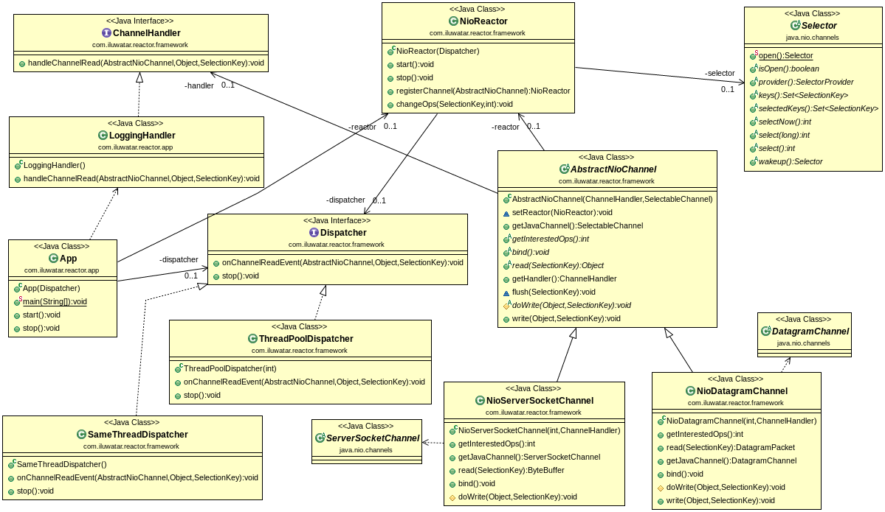
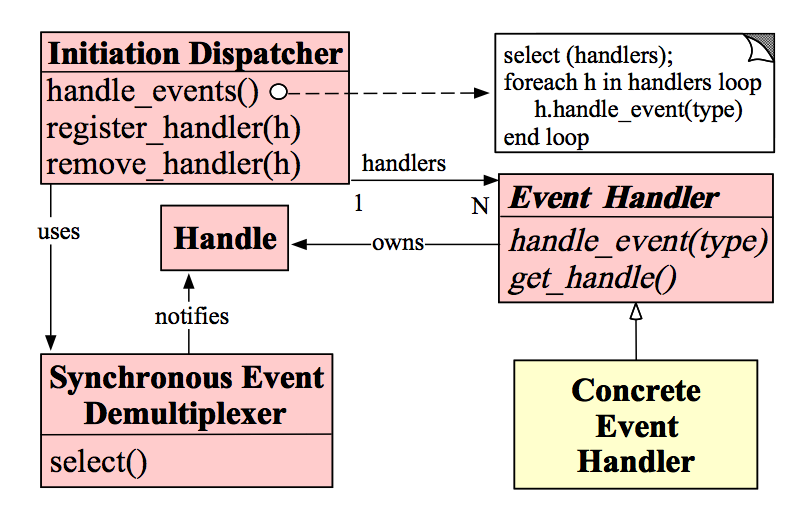

# Reactor

The Reactor design pattern handles service requests that are delivered concurrently to an application by one or more clients. The application can register specific handlers for processing which are called by reactor on specific events. Dispatching of event handlers is performed by an initiation dispatcher, which manages the registered event handlers. Demultiplexing of service requests is performed by a synchronous event demultiplexer.

## Class diagram

## Mode structure

## Reference

[高性能IO之Reactor模式](https://www.cnblogs.com/doit8791/p/7461479.html)

